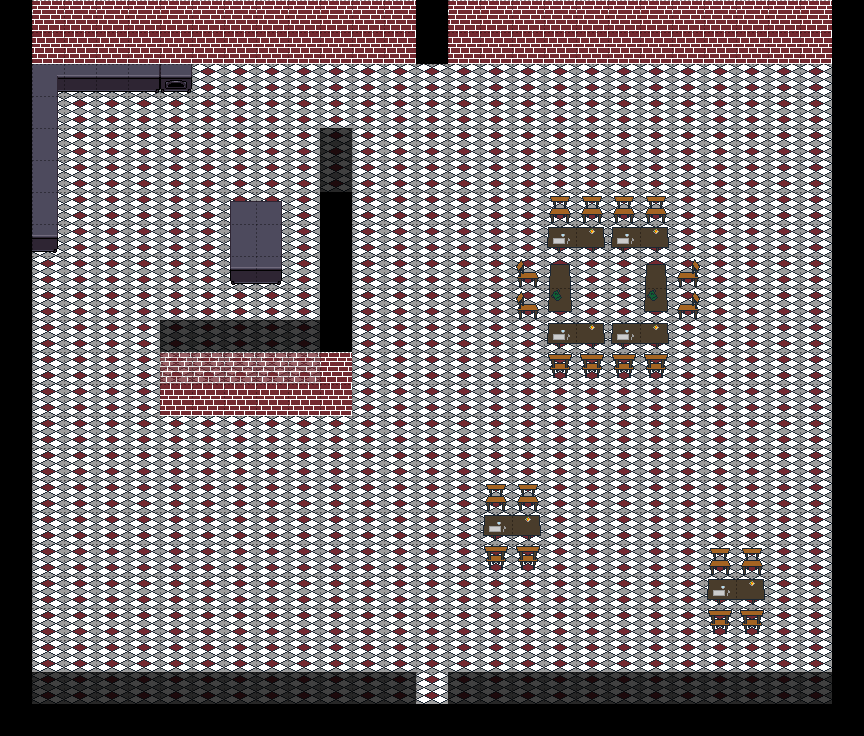
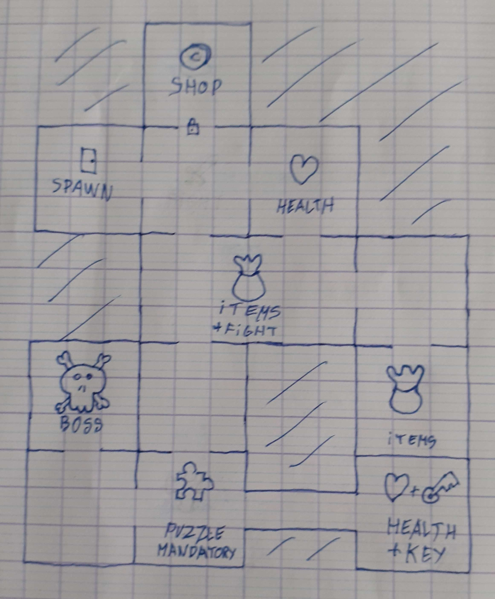
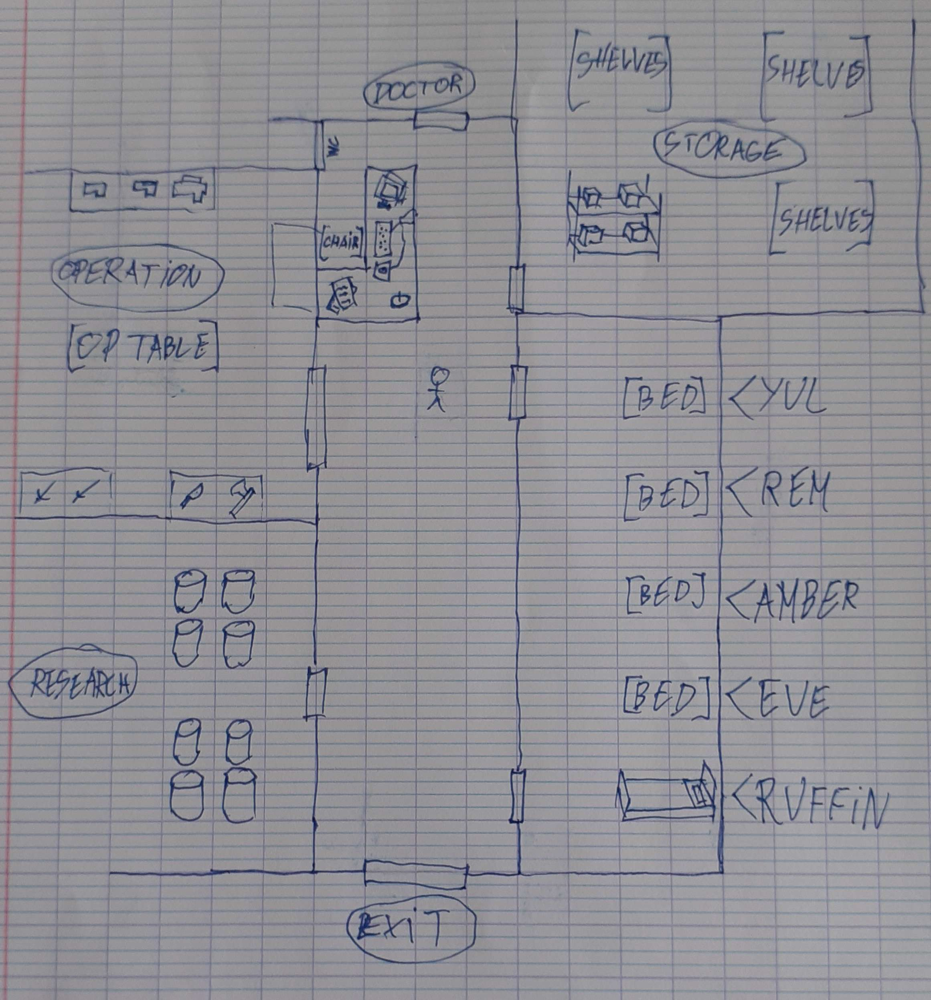

Table of Content

- [Context and goal](#context-and-goal)
  - [Genre](#genre)
  - [Theme](#theme)
- [Characters](#characters)
  - [Yul (Main character)](#yul-main-character)
  - [Rim](#rim)
  - [Amber](#amber)
  - [Eve](#eve)
  - [Rufin](#rufin)
- [Functional Requirements](#functional-requirements)
  - [Levels and rooms](#levels-and-rooms)
  - [Player](#player)
  - [Enemies](#enemies)
  - [Fighting](#fighting)
  - [Abilities](#abilities)
  - [Loading and saving](#loading-and-saving)
  - [Other](#other)
- [Acceptance criteria](#acceptance-criteria)
- [Design](#design)
  - [Room example](#room-example)
  - [Level example](#level-example)
  - [Hub design](#hub-design)
- [Security \& law](#security--law)
- [Environment](#environment)
- [Cost](#cost)
- [Deliverables and deadlines](#deliverables-and-deadlines)
- [Glossary](#glossary)

# Context and goal

ALGOSUP is a Computer Science school based in Vierzon, France, from which we are students.

As part of our courses, we were tasked to create a video game.
The genre and theme were not imposed.

## Genre

Our game will be a Rogue-like[^1] game.

In this genre of game, the player must progress through different levels, each containing multiple enemies-filled rooms, and make their way to the end.

Each level has its own theme and setting, notably with different sprites[^2] and enemies.
Additionally, the final room in a level will always be a boss[^3], an enemy more difficult than the others.

By killing enemies and completing rooms, the player will be rewarded with bonuses to help them as the difficulty of the game increases as the player progresses.

There will also be puzzles of different types as described in a further paragraph.

## Theme

The theme of our game will be hospitalization and recovery. The hub itself will be part of a hospital.

Our characters will go through their memories and try to heal, each in their own way -- in the case of our main character, remembering who he is.

Furthermore, their ability will differ depending on their illness. The ability bar is the main selling point of the game and gives power-ups to the player.

# Characters

We defined 5 playable characters to be implemented.
<!-- TODO: Add More info about the additional character -->

## Yul (Main character)

Gender: Male
Age: 38
Nationality: Russian
Hospitalization: Amnesia
Job: Teacher
Character: Submissive, uncharismatic, breathes fast, and generally looks down
Defining trait: Tried to commit suicide because he is a teacher in a school and is being abused by the students

## Rim

Gender: Female
Nationality: Egyptian
Hospitalization: Rage

## Amber

Gender: Female
Nationality: American
Hospitalization: Madness

## Eve

Gender: Female
Nationality: British
Hospitalization: Schizophrenia

## Rufin

Gender: Male
Nationality: Polish
Hospitalization: Obesity

# Functional Requirements

Note: Every requirement in **bold** is needed for the alpha version[^4] of the game.

## Levels and rooms

- Each level, room, and puzzle should be generated procedurally[^6]
- **The levels will contain 5 combat rooms for the first level (plus the tutorial one) up to 12, including the boss room**
- Additionally to those, there will be shops, items, and bonus rooms
- **The levels should contain one mandatory puzzle on the main path to the boss room**
- **The rooms and the doors between the rooms should be aligned on a grid pattern for simplicity (doors should be centered)**
- Misalignment might be added later on if it does not affect the gameplay and player experience

## Player

- **The player should move around with WASD[^5]** or the equivalent on their keyboard
- The default speed is 12.5 tiles per second

## Enemies

- **There should be between 3 and 6 enemies per room**
- **The enemies will follow the player until the death of one of them**
- There will be 3 categories of enemies:
  - **Melee (close combat)**
  - Ranged
  - Shielded (slower but higher defense)
- Unless specified otherwise on the enemies specification sheet, their default speed is the same as the player
- The enemies' weapon collider should grow 10% in easy mode and shrink 20% in hard mode

## Fighting

- **The character's direction should follow the player's cursor**
- **The player will attack/shoot in the direction of their cursor**
- The weapon's sprite should rotate around the hand in the direction the player is attacking
- **The player should use their weapon with left-click**
- When the weapon runs out of ammo or once the player attacks for those that don't have any capacity, the player won't be able to attack again for a certain amount of time, specified in the "fire rate" section of the weapon's definition

## Abilities

- There will be an ability bar at the middle and bottom of the screen. It fills up slightly with each hit given to enemies
- The ability is passive: Once the ability bar fills up, it activates the character's ability as described thereafter
  - Yul: An item or a memory pops. This ability can only be used once per run (the bar will not fill up afterward)
  - Rim: Increases her attack damage. Continuous until she takes any damage
  - Amber: Fast movements and her rolls deal damage to enemies. Resets when she rolls without touching any enemy
  - Eve: A clone that deals 75% of her damage. Disappears once hit
  - Rufin: Damages taken are reduced by a 20% for 30 seconds

## Loading and saving

- **The game should load/save its state in a file**
- **The game should automatically save at the end of each room**
- There should be up to 5 save slots
- **The saves do not need to be named**

## Other

- **Yul should be the only character implemented for the alpha**
- **The first room on the first floor will be empty. Instead, it will contain tiles on how to play the game.**
- The hub will be composed of five areas:
  - The corridor that gives access to the other areas
  - The ward with 5 beds (one for each character), where the player can change character by interacting with the bed
  - The research room acts as the bestiary and holds the different enemies in research tanks
  - The operation room with the different weapons on display
  - The storage room with the different items the player can use
  - There will also be two doors, one to the outside that quits the game, and one to the doctor's room to start playing
- Each additional character will be unlocked by getting diverse achievements
- Upon crash, the game should write a log file to trace the errors
- The contrast on the sprites should be high enough for people with disabilities

# Acceptance criteria

To ensure the game is working properly and is complete as per these requirements, we will have our QA test the game and verify that it does not contain any defects.

Additionally, we will regularly have external users play the game at different stages of development to ensure we are on the right track, editing the specifications as necessary.

The product will also be deemed complete to ship for the presentation when:
- The alpha version is complete (all requirements in **bold**)
- The alpha version is fully working (no bugs remaining in the tracker)

# Design

## Room example

## Level example

## Hub design

# Security & law

We will not be collecting user data. The engine we will be using won't collect anything either. There is no issue with confidentiality. It also means that GDPR is respected.

If the user decides to modify the game by modding it or changing the values at a lower level, we consider they know what they are doing and will not be held responsible if there happened to be consequences.

We will publish our game only on [GitHub](https://github.com/algosup/2022-2023-project-4-game-design-Team-8). Any other website proposing our game is to NOT be trusted as we cannot guarantee its authenticity.

# Environment

The game should be less than 2GB in size and run on less than 5GB of RAM.

For the CPU, benchmarking will be required to determine the minimal requirements.

For the software, we will use Unreal Engine[^7] 4.27 and its requirements.

# Cost

The game should be made with a minimal budget, none to the extent of our abilities.

This requires us to use a mix of creating our own assets and using free ones from the internet.

As for the workforce, there will be 5 people available 14 to 21 hours a week.

# Deliverables and deadlines

- March 3rd 2023
  - One Sheet Documents
- March 10th 2023
  - Working Prototype
- March 24th 2023
  - Demo / Vertical slice
- April 14th 2023
  - Working game (Beta or even Final version)
  - Management summary
  - Final specifications (both Functional and Technical)
  - Testing plan

# Glossary

[^1]: Rogue-like: A type of video game deriving from the original *Rogue* (1980) in which the player moves through a dungeon, fighting enemies along the way. [Wikipedia](https://en.wikipedia.org/wiki/Roguelike)
[^2]: Sprite: A 2D image that represents a character, creature or object. [Wikipedia](https://en.wikipedia.org/wiki/Sprite_(computer_graphics))
[^3]: Boss: Very powerful and dangerous (often bigger) enemy that is present at the end of a level as a final test for the player. [Wikipedia](https://en.wikipedia.org/wiki/Boss_(video_games))
[^4]: Alpha: A version of the game that misses some final features and contains bugs. [Wikipedia](https://en.wikipedia.org/wiki/Software_release_life_cycle#Alpha)
[^5]: WASD: Movement keys for the majority of video games (respectively up, left, down and right). [Wikipedia](https://en.wikipedia.org/wiki/Arrow_keys#WASD_keys)
[^6]: Procedural: A method that randomly creates content (in our case, the levels and room layout). [Wikipedia](https://en.wikipedia.org/wiki/Procedural_generation)
[^7]: Unreal Engine: A set of tools, mostly a 3D engine, for game development from [Epic Games](https://epicgames.com/). [Website](https://www.unrealengine.com)